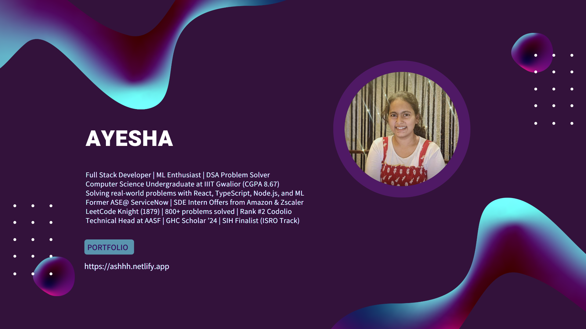

<!--   -->
<h1 align="left">Hey , I'm Ayesha !</h1>

<h3 align="left">A digital alchemist from India, transforming ideas into extraordinary code.</h3>

### 🙋‍♂️ About Me

- 🌱 I’m currently learning **Three.js, Machine Learning, and advanced frameworks**
  
- 🔭 I’m currently sharpening my skills in Data Structures and Algorithms to tackle complex problems efficiently.

<!-- - 👨‍💻 All of my projects are available at **** -->

- 📫 Reach me at **ayesha19765@gmail.com**
  
- 🌐  More of me at at [https://ashhh.netlify.app/](https://ashhh.netlify.app/)

- ⚡ Fun fact **I think I am a human "404 Not Found" error when it comes to remembering where I put my keys! 😂**

### 🎶 Spotify Playing

### 🚀 Languages and Tools

	
	
	
	
	
	
	
	
	
	
	
	
	
	
	
	
	
	
	
	
	
	
	
	
	
	
	
	
	
	
	
	
	

<!--### 📊 My Github Stats -->
<!-- 

 
 -->

### ✍️ Random Dev Quote

<!-- 
 
   

  
 -->

