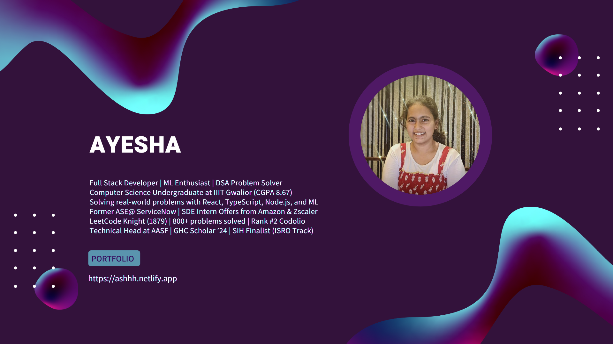

<!--  -->

<h1 align="left">
Hey 👋, I'm Ayesha!
</h1>

Software Engineer | GenAI & Machine Learning Enthusiast | Competitive Programmer

## 👩‍💻 About Me

- 🚀 Software Engineer passionate about building scalable systems and AI-powered applications.
- 🤖 Experienced in Generative AI, LLM evaluation, prompt engineering, and ML-based solutions.
- 💻 Worked on AI-powered Playbook Summarization at **ServiceNow**, integrating LLM workflows, GraphQL APIs, and scalable backend systems.
- 🧠 Built projects across Computer Vision, Deep Learning, Full-stack Development, and Distributed Systems.
- 🏆 LeetCode Knight (1879) with 700+ problems solved.
- 🎓 B.Tech Computer Science @ IIIT Gwalior (2022-2026).

📫 Reach me: **ayesha19765@gmail.com**

🌐 Portfolio: **https://ashhh.netlify.app/**

## 🚀 Tech Stack

### Languages

C++ • Python • Java • JavaScript • TypeScript • SQL

<!-- Languages -->

 

<!-- AI / ML -->

### AI / Machine Learning

TensorFlow • PyTorch • Keras • Scikit-learn • Deep Learning • LLM Evaluation • Prompt Engineering

 

### Frontend

React • Next.js • Tailwind

<!-- Frontend -->

 

<!-- Backend -->

### Backend & Systems

Node.js • Express.js • Flask • FastAPI • REST APIs • GraphQL • Distributed Systems

 

<!-- Databases & Cloud -->

### Databases & Cloud

MongoDB • MySQL • PostgreSQL • Docker • AWS • Git • Postman

<!-- Tools -->

## 🌟 Featured Work

### 🤖 AI-Powered Playbook Summarization — ServiceNow
- Built GenAI workflows using NowAssist, GraphQL APIs, and async AMB workflows.
- Improved LLM evaluation scores from **77.78% → 91.67%** through prompt optimization and evaluation.

### 📦 DefektGuard — AI Computer Vision System
- Developed a damage detection pipeline achieving **91%+ accuracy**.
- Built React dashboard + Flask backend for warehouse inspection workflows.

### 🛡 Cyber-Sanrakshak — Context-Aware Firewall
- Designed ML-driven anomaly detection with scalable backend architecture supporting 50+ nodes.

### 🩺 OCT Image Enhancement using SRGANs
- Built a GAN-based medical image enhancement pipeline improving scan quality for analysis.

## 🏆 Achievements

- 🥇 **Llama Award — ServiceNow Q1 2026**
- ⭐ **LeetCode Knight (1879)** | Top 5.5% globally | 700+ problems solved
- 🌎 Global Rank **907/33000+** in LeetCode Weekly Contest 428
- 🏆 Finalist — Smart India Hackathon 2024 (ISRO)
- 🎓 Grace Hopper Celebration Scholarship ’24

## 🐍 Feeding my Pet

  <picture>
    <source media="(prefers-color-scheme: dark)" srcset="https://raw.githubusercontent.com/ayesha19765/ayesha19765/output/github-contribution-grid-snake-dark.svg">
    <source media="(prefers-color-scheme: light)" srcset="https://raw.githubusercontent.com/ayesha19765/ayesha19765/output/github-contribution-grid-snake.svg">
    
  </picture>

